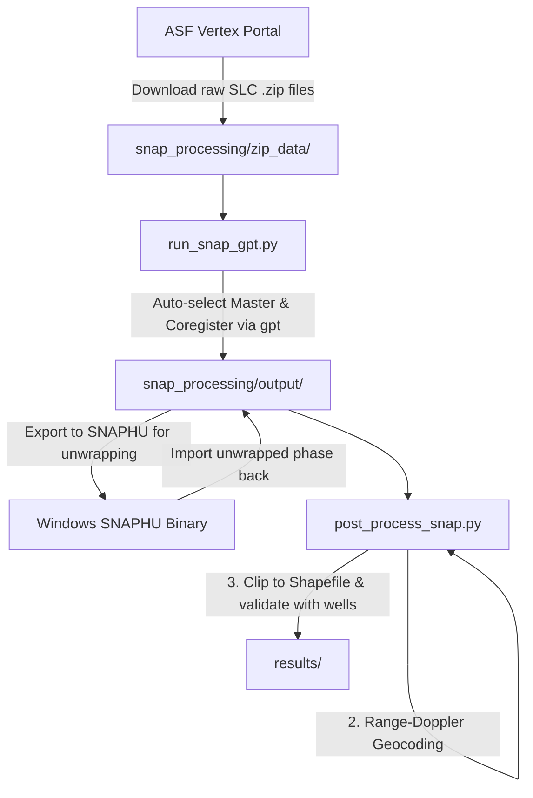

# Sentinel-1 InSAR Processing Workflow (Native Windows Automation)

This repository contains a native Windows automation pipeline for **Sentinel-1 InSAR processing** using the European Space Agency's **SNAP (Sentinel Application Platform)** toolbox and the **SNAPHU** phase unwrapping algorithm.

It automates raw Single Look Complex (SLC) data coregistration, interferogram generation, coherence estimation, and topographic phase removal via SNAP's **Graph Processing Tool (GPT)**, followed by a Python-based geocoding and groundwater validation suite.

---

## 📡 Understanding Sentinel-1 InSAR Data

For those reviewing this workflow, here is a brief technical overview of how Sentinel-1 data is used to measure land subsidence:

### 1. Synthetic Aperture Radar (SAR)
Unlike optical satellites (which rely on sunlight), Sentinel-1 uses an active microwave radar. This allows it to "see" through clouds, rain, and darkness, providing consistent high-resolution data regardless of weather conditions.

### 2. Single Look Complex (SLC) Data
Sentinel-1 images used for this analysis are downloaded in the **SLC** format. Every pixel in an SLC image contains a complex number representing two things:
- **Amplitude**: The strength of the radar signal returning to the satellite (useful for identifying structures and terrain features).
- **Phase**: The fraction of the radar wavelength cycle when it returns. This phase is highly sensitive to the distance between the satellite and the ground.

### 3. Interferometric SAR (InSAR)
InSAR involves taking two SLC images of the same area at different times (a **Master** and a **Slave** image). By aligning (coregistering) them at the sub-pixel level and computing the difference in their phase, we create an **Interferogram**. 
If the ground has subsided between the two acquisitions, the distance the radar pulse travels increases, causing a measurable shift in the phase. Because the Sentinel-1 radar wavelength is ~5.5 cm, even a phase shift of a few millimeters can be detected.

### 4. Coherence
This is a measure of how stable the ground targets are between the two satellite passes. Vegetation, water, or construction can cause the radar reflection to change entirely, leading to low coherence. High coherence (like in urban areas or bare rock) is required to accurately extract deformation.

### 5. Phase Unwrapping (SNAPHU)
The raw interferogram only records phase modulo $2\pi$ (wrapped like a repeating color cycle). To convert this repeating cycle into an absolute measurement of ground movement (in millimeters), we run a complex mathematical optimization called **Phase Unwrapping** using the SNAPHU network flow algorithm.

---

## Processing Pipeline Steps



---

## Step 1: Install Prerequisites

1. **Install ESA SNAP**:
   * Download and install the **64-bit Windows Installer** for the Sentinel-1 Toolbox from the [ESA SNAP Download Page](https://step.esa.int/main/download/snap-download/).
   * **Crucial:** During installation, ensure the SNAP bin folder (usually `C:\Program Files\snap\bin`) is added to your Windows **System Environment Variable PATH** so the `gpt` command is globally accessible.
2. **Download SNAPHU for Windows**:
   * Download the pre-compiled `snaphu.exe` binary. Ensure it is accessible within the pipeline directory.

---

## Step 2: Download Sentinel-1 SLC Data

1. Open the [ASF Vertex Search Portal](https://search.asf.alaska.edu/).
2. Define a bounding box around **East Singhbhum (Lat 22.15 to 23.05, Lon 86.05 to 86.9)**.
3. Apply filters:
   * **File Type**: `SLC` (Single Look Complex)
   * **Relative Orbit (Track)**: `121` (Descending) — *Verified track covering East Singhbhum.*
4. Move all downloaded `.zip` files into the data directory: `snap_processing/zip_data/`

---

## Step 3: Coregistration and Interferogram Automation

Our Python automation script scans the `zip_data/` directory, auto-selects the optimal Master image based on temporal baseline spacing, and runs `gpt` to coregister the stack and remove the topographic phase:

```bash
python run_snap_gpt.py --zip_dir ./zip_data --out_dir ./output --subswath IW2
```

**What this script handles under the hood:**
* Auto-downloads precise orbit ephemerides.
* Uses the highly stable `SRTM 3Sec` DEM for Back-Geocoding (avoiding silent masking failures common with the 1Sec server).
* Outputs wrapped interferograms and coherence data in BEAM-DIMAP (`.dim` / `.data`) format.

---

## Step 4: Phase Unwrapping (SNAPHU)

To convert the wrapped phase into absolute displacement, we unwrap the phase using SNAPHU natively on Windows. 

*Note: The pipeline employs specific mitigations for Windows. Because the compiled SNAPHU binary can suffer from memory/threading crashes when attempting parallel Minimum Spanning Tree (MST) resolution on massive SAR arrays, we strictly configure `snaphu.conf` to run sequentially (`NPROC 1`) while partitioning the data into an overlapping 4x10 grid (`NTILEROW 4`, `NTILECOL 10`).*

1. **Export**: Run `gpt SnaphuExport` to format the phase and coherence arrays.
2. **Unwrap**: Execute `snaphu.exe -f snaphu.conf ...`
3. **Import**: Run `gpt snaphuImport.xml` to merge the unwrapped phase back into the SNAP product stack.

---

## Step 5: Terrain Correction (Geocoding)

Because the unwrapped phase is still in the radar's native slant-range geometry, it must be projected onto a standard WGS84 map grid using Range-Doppler Terrain Correction:

```bash
gpt Terrain-Correction -Ssource="./output/insar_unwrapped_stack.dim" -PdemName="SRTM 3Sec" -PpixelSpacingInMeter=30 -PmapProjection="WGS84(DD)" -t "./output/insar_tc.dim"
```

---


## Step 6: Post-Processing & Groundwater Validation

Run our Python validation suite on the geocoded product to convert the unwrapped phase to vertical displacement rate (mm/yr), clip it to the district boundary, and correlate it directly against CGWB groundwater monitoring well data:

```bash
python post_process_snap.py --insar_file ./output/insar_tc.dim --well_file "../East Singhbum_1354.xlsx" --shapefile "../shapefile/East_singhum_wgs.shp" --out_dir ../results
```

### Generated Outputs:
* **`Fig7_InSAR_vertical_velocity_map.png`**: Geocoded spatial map of subsidence rate cropped to block boundaries.
* **`Fig8_InSAR_vs_Groundwater_TimeSeries.png`**: Multi-year correlation chart validating InSAR subsidence against measured well water table declines.
* **`insar_block_summary.csv`**: Zonal statistics summary comparing model estimates with measured ground truth rates.
