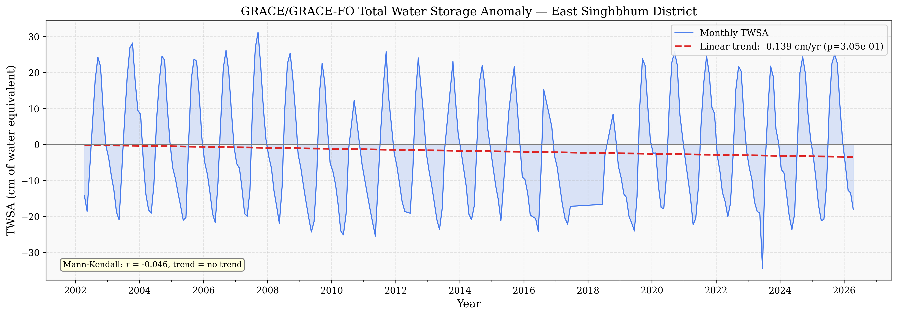
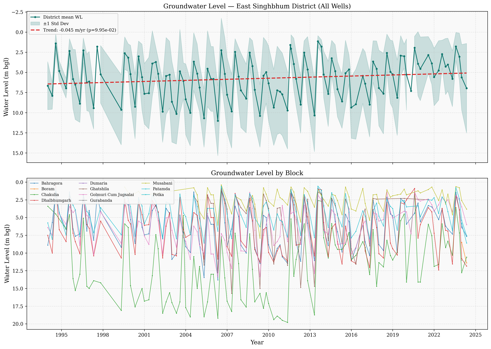
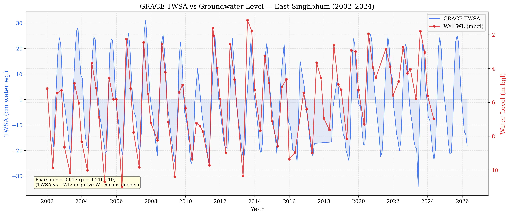
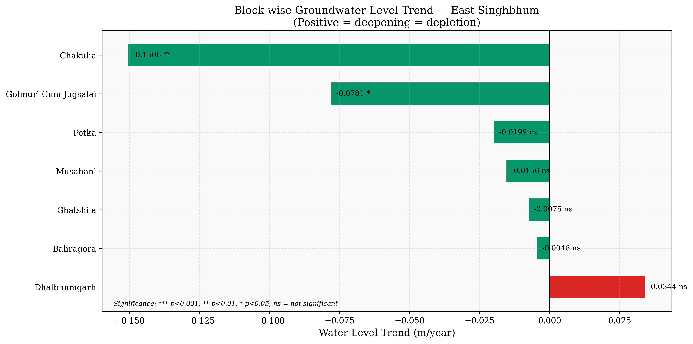
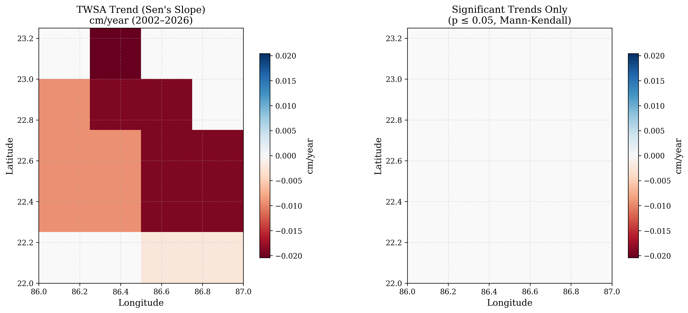
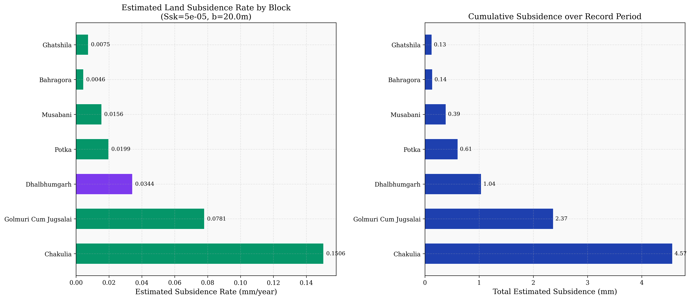

# Land Subsidence Analysis Results — East Singhbhum

## Script & Outputs

- **Script**: [land_subsidence_analysis.py](./land_subsidence_analysis.py)
- **Results folder**: [results/](./results)
- **Summary CSV**: [subsidence_summary.csv](./results/subsidence_summary.csv)

---

## Figure 1: GRACE TWSA Time Series (2002–2026)

**Key findings:**
- TWSA oscillates between **-34 cm** (dry season) and **+31 cm** (monsoon)
- Linear trend: **-0.139 cm/year** (p = 0.305, not statistically significant)
- Mann-Kendall test: **no significant trend** (tau = -0.046)
- This suggests total water storage in East Singhbhum is **relatively stable** over the GRACE period

---

## Figure 2: Groundwater Level Time Series (1994–2024)

**Key findings:**
- Top panel: District-wide mean WL trend is **-0.045 m/year** (p = 0.10)
- Strong seasonal pattern: water levels are shallowest in Aug-Nov (monsoon recharge), deepest in May (pre-monsoon)
- Bottom panel: Blocks like **Chakulia** and **Musabani** show deeper water levels, while **Golmuri Cum Jugsalai** (Jamshedpur urban area) is relatively shallow

---

## Figure 3: GRACE TWSA vs Groundwater Level (2002–2024)

**Key finding:**
- **Pearson r = 0.617 (p = 4.2 × 10⁻¹⁰)** — strong, statistically significant correlation
- This validates that GRACE satellite data reliably captures the groundwater dynamics observed in wells
- Both datasets show the same seasonal pattern: peaks during monsoon, troughs during dry season

---

## Figure 4: Block-wise Groundwater Level Trends

**Key findings:**

| Block | WL Trend (m/yr) | Significance | Interpretation |
|-------|-----------------|--------------|----------------|
| **Chakulia** | -0.1506 | ** (p<0.01) | Significant water level rise (recovery) |
| **Golmuri Cum Jugsalai** | -0.0781 | * (p<0.05) | Significant water level rise |
| Dhalbhumgarh | +0.0344 | ns | Slight deepening (depletion) |
| Potka | -0.0199 | ns | Slight rise |
| Musabani | -0.0156 | ns | Slight rise |

> **Note:**
> **Negative trends here mean water level is RISING (getting shallower) — this is actually GOOD news.** The WL(mbgl) is "meters below ground level", so a negative trend means the water table is coming closer to the surface. Only **Dhalbhumgarh** shows a deepening trend.

---

## Figure 5: Pixel-wise TWSA Trend Map (Sen's Slope)

**Key findings:**
- All pixels show **negative trends** (-0.002 to -0.02 cm/year) — slight water storage decline
- The eastern part of the district shows stronger decline
- **Right panel is blank** — no pixels have statistically significant trends (p ≤ 0.05)
- This confirms the overall TWSA is stable with no alarming depletion

---

## Figure 6: Estimated Land Subsidence

### Block-wise Subsidence Results

| Block | Subsidence Rate (mm/yr) | Total Subsidence (mm) |
|-------|------------------------|-----------------------|
| **Chakulia** | 0.1506 | 4.57 |
| **Golmuri Cum Jugsalai** | 0.0781 | 2.37 |
| Dhalbhumgarh | 0.0344 | 1.04 |
| Potka | 0.0199 | 0.61 |
| Musabani | 0.0156 | 0.39 |
| Bahragora | 0.0046 | 0.14 |
| Ghatshila | 0.0075 | 0.13 |

**District Average:** 0.044 mm/year, 1.32 mm total over ~30 years

---

## Overall Interpretation

> **Important:**
> **East Singhbhum shows very low land subsidence risk.** The estimated subsidence is less than 5 mm over 30 years, which is negligible in practical terms.

### Why subsidence is low here:

1. **Hard-rock terrain** — The Singhbhum Craton / Chotanagpur Plateau is composed of crystalline hard rock, which is inherently resistant to compaction (unlike alluvial plains like Indo-Gangetic plains)
2. **No significant groundwater depletion** — Most blocks show stable or *rising* water levels
3. **Good monsoon recharge** — The strong seasonal TWSA recovery indicates good natural recharge
4. **Limited large-scale pumping** — Unlike intensively irrigated regions, East Singhbhum doesn't have the same scale of groundwater extraction

### Aquifer Parameters Used

| Parameter | Value | Notes |
|-----------|-------|-------|
| Specific Yield (Sy) | 0.03 | Default for hard rock |
| Skeletal Specific Storage (Ssk) | 5 × 10⁻⁵ m⁻¹ | Default for hard rock |
| Aquifer Thickness (b) | 20 m | Weathered zone assumption |

> **Tip:**
> You can adjust these parameters in the script (lines 66-68 of [land_subsidence_analysis.py](./land_subsidence_analysis.py)) if you obtain actual values from CGWB reports for East Singhbhum.

---

## Next Steps

1. **For more accurate results**: Download GLDAS data to isolate Groundwater Storage Anomaly (GWSA) from TWSA
2. **For publication-quality subsidence maps**: Process Sentinel-1 InSAR data using the local [SNAP Windows workflow](./snap_processing/README.md)
3. **For validation**: Compare with CGWB aquifer reports and any available GPS/leveling data
4. **Sensitivity analysis**: Vary Sy, Ssk, and b to understand the range of possible subsidence estimates
